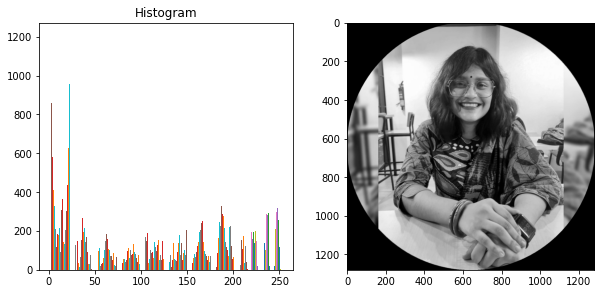

# Image-Processing
Used Entropy compression , LocoI to process Image to different sizes and bit-rate

#Prediction_Image1                                              #Prediction_Image 2
</img>           </img>
#Prediction_Image 3                                             #Prediction_Image 4
 </img>          </img>                                                                
 #Prediction_Image 5                                            #Prediction_Image 6
</img>           </img>
  #Prediction_Image 7                                            #Prediction_Image LocoI                       
</img>            </img>

